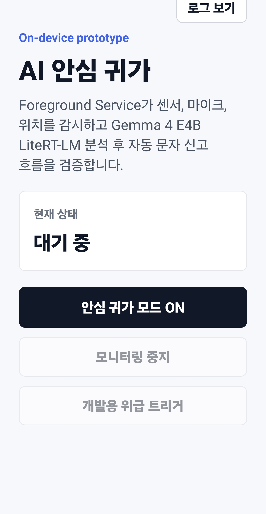
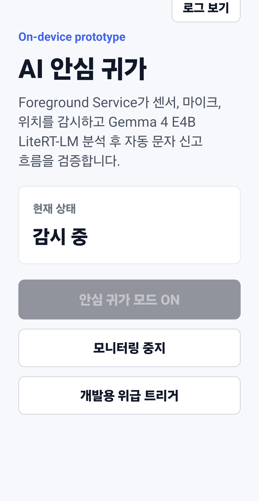
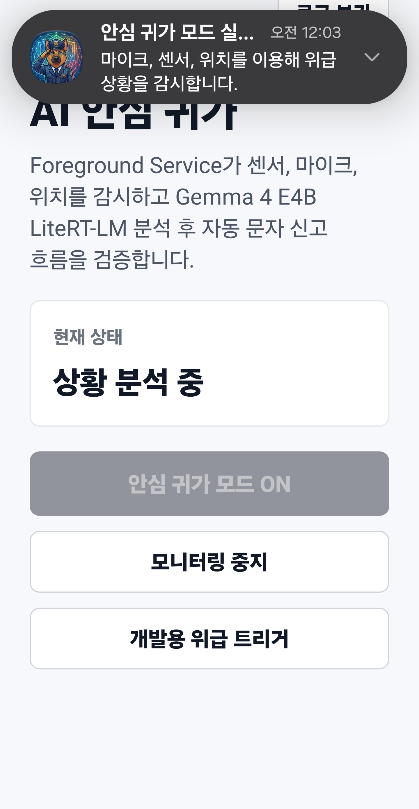
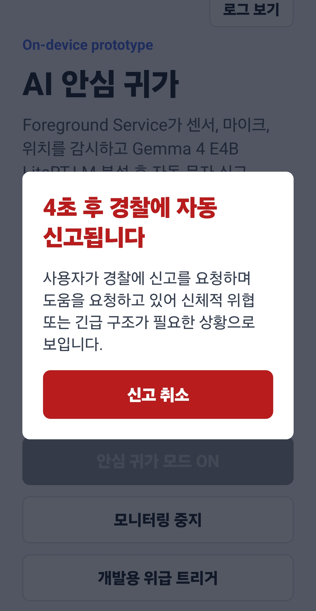
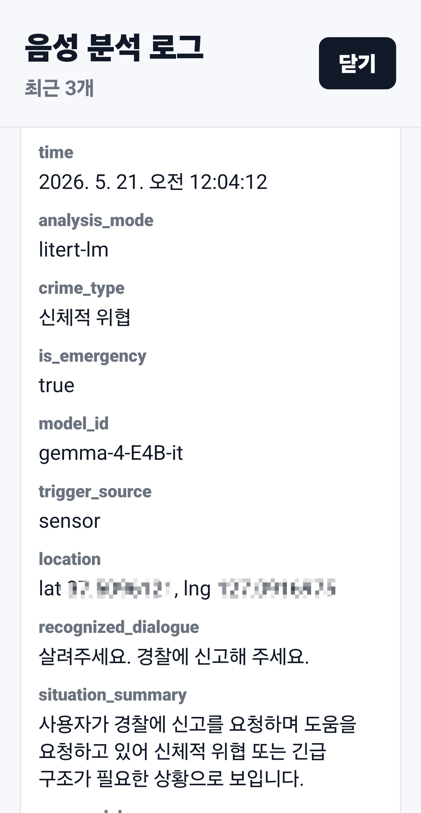
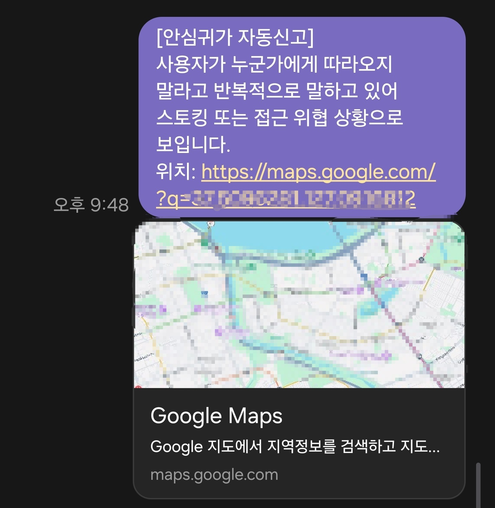

# OnGuard AI

OnGuard AI는 밤늦게 인적이 드문 길로 귀가할 때 두려움과 걱정을 겪는 여성, 어린이, 노약자 등 안전 취약 사용자를 위한 온디바이스 AI 안심 귀가 Android 프로토타입입니다.

사용자가 `안심 귀가 모드 ON`을 누르면 Android Foreground Service가 센서와 마이크를 계속 감시합니다. 급격한 움직임이나 큰 소리 같은 이상 징후가 감지되면, 직전/직후 오디오를 온디바이스 LLM으로 분석하고 실제 위급 또는 범죄 상황으로 판단될 때 자동 문자 신고 흐름을 수행합니다.

> 현재 프로젝트는 로컬 APK 직접 설치와 디버그 목적의 프로토타입입니다. 실제 긴급 신고, Google Play 배포, 상용 안전 서비스로 바로 사용할 수준의 검증을 완료한 상태가 아닙니다.

## 대상 사용자

- 밤늦게 혼자 귀가하는 사람
- 인적이 드문 길에서 불안감을 느끼는 여성, 어린이, 노약자
- 직접 휴대폰 조작이 어려운 위협 상황에서 자동 신고 보조가 필요한 사용자

## 핵심 사용 흐름

1. 사용자가 앱에서 `안심 귀가 모드 ON`을 누릅니다.
2. Android Foreground Service가 시작되고 가속도/자이로 센서 모니터링과 음향 이벤트 감지가 활성화됩니다.
3. 뛰기, 넘어짐, 몸싸움처럼 보이는 급격한 움직임 또는 큰 소리가 감지되면 트리거가 발생합니다.
4. 트리거 전후의 마이크 PCM 오디오를 수집하고, 위치 정보를 함께 확보합니다.
5. 수집된 오디오는 기기 내부의 Gemma 4 E4B LiteRT-LM 모델로 전달됩니다.
6. 모델은 음성 및 상황 단서를 분석해 JSON 형태로 위급 여부를 반환합니다.
7. `is_emergency=true`이면 앱이 카운트다운 팝업을 띄우고 사용자가 취소할 시간을 줍니다.
8. 취소하지 않으면 위치 링크와 상황 요약을 SMS로 전송합니다.

## 화면 흐름

아래 스크린샷은 사용자가 앱을 켜고 안심 귀가 모드를 시작한 뒤, 트리거 감지와 모델 분석, 신고 전 취소 대기, 분석 로그 확인, 문자 전송까지 이어지는 흐름을 보여줍니다.

| 1. 대기 화면 | 2. 안심 귀가 모드 실행 |
| --- | --- |
|  |  |
| 사용자는 `안심 귀가 모드 ON`을 눌러 감시를 시작합니다. | 모드가 켜지면 앱은 감시 중 상태로 전환되고 모니터링 중지와 개발용 트리거를 사용할 수 있습니다. |

| 3. Foreground Service 알림 | 4. 위급 상황 판단 후 신고 전 대기 |
| --- | --- |
|  |  |
| Android 알림 영역에 감시 중인 Foreground Service가 표시됩니다. | 모델이 실제 위급 상황으로 판단하면 자동 신고 전 카운트다운을 띄우고 사용자가 취소할 기회를 줍니다. |

| 5. 음성 분석 로그 | 6. 문자 신고 결과 |
| --- | --- |
|  |  |
| 최근 10개의 모델 분석 결과를 앱 안에서 확인할 수 있습니다. | 취소하지 않으면 상황 요약과 위치 링크가 포함된 문자가 전송됩니다. |

## 사용 기술

- 프레임워크: React Native CLI 0.85.3
- 언어: TypeScript, Kotlin
- Android 구조: React Native New Architecture 및 Fabric 기반 프로젝트 구조
- 백그라운드 실행: Foreground Service
- 네이티브 센서: Android SensorManager 가속도계 및 자이로스코프
- 오디오 캡처: Android AudioRecord, 16 kHz PCM 링 버퍼
- 위치 수집: Android LocationManager
- 문자 전송: Android SmsManager
- 온디바이스 AI: Google AI Edge LiteRT-LM
- 모델: Gemma 4 E4B IT LiteRT-LM 모델 파일, `gemma-4-E4B-it.litertlm`
- 로컬 영구 저장: 최근 분석 로그 저장용 Android SharedPreferences

## 현재 구현 상태

### React Native 계층

`App.tsx`가 사용자에게 보이는 상태 흐름과 화면을 관리합니다.

- `idle`: 모니터링이 꺼진 상태
- `warming`: 모델 준비를 요청한 상태
- `monitoring`: 센서와 오디오를 감시 중인 상태
- `analyzing`: 트리거가 발생해 오디오를 분석 중인 상태
- `countdown`: 위급 상황으로 판단되어 신고 전 취소 대기 중인 상태
- `sent`: 문자 전송 요청이 큐에 들어간 상태
- `cancelled`: 사용자가 신고를 취소한 상태
- `error`: 권한, 네이티브 모듈, 런타임 오류가 발생한 상태

메인 화면에는 다음 동작이 있습니다.

- `안심 귀가 모드 ON`
- `모니터링 중지`
- `개발용 위급 트리거`
- `로그 보기`

`로그 보기`에서는 최근 AI 음성 분석 로그 10개를 확인할 수 있습니다. 로그는 Android 네이티브 브릿지를 통해 저장되므로 앱 프로세스가 종료된 뒤에도 남아 있습니다. 새 로그가 저장될 때 10개를 초과한 오래된 항목은 삭제됩니다.

저장되는 로그 항목은 다음과 같습니다.

- `analysis_mode`
- `crime_type`
- `is_emergency`
- `location`
- `model_id`
- `raw_model_response`
- `recognized_dialogue`
- `situation_summary`
- `trigger_source`
- `litert_error`

### Android 네이티브 계층

Kotlin 네이티브 코드는 React Native 브릿지와 백그라운드 실행 로직을 제공합니다.

- `EmergencyNativeModule.kt`
  - 모니터링 서비스 시작 및 중지
  - `SmsManager`를 통한 문자 전송
  - 사이렌 알림 시작 및 중지
  - `SharedPreferences`를 통한 최근 분석 로그 로드 및 저장

- `EmergencyForegroundService.kt`
  - Foreground Service로 실행
  - 센서와 마이크 모니터링 유지
  - PCM 링 버퍼 유지
  - GPS 및 위치 수집
  - React Native 이벤트 발행
    - `serviceStatus`
    - `triggerDetected`
    - `analysisDebug`
    - `analysisResult`
    - `smsStatus`
    - `nativeError`

- `LiteRtGemmaAnalyzer.kt`
  - 로컬 LiteRT-LM Gemma 모델 로드
  - 무음 구간을 잘라낸 오디오 컨텍스트를 모델에 전달
  - 엄격한 JSON 출력 요청
  - 모델 출력을 다음 형태로 파싱

```json
{
  "is_emergency": true,
  "crime_type": "스토킹",
  "situation_summary": "사용자가 밤길에서 누군가 따라오는 상황을 거부하며 도움 또는 신고가 필요해 보입니다.",
  "recognized_dialogue": "따라오지 마세요"
}
```

## 트리거와 오디오 처리 흐름

### 1. 모니터링 시작

`안심 귀가 모드 ON`을 누르면 다음 흐름이 실행됩니다.

- Android 런타임 권한을 요청합니다.
- LiteRT-LM 모델 준비를 요청합니다.
- `EmergencyForegroundService`가 포그라운드 알림과 함께 시작됩니다.
- 오디오 녹음과 센서 리스너가 등록됩니다.

### 2. 트리거 감지

서비스는 다음 조건에서 분석을 시작할 수 있습니다.

- 센서 트리거: 뛰기, 넘어짐, 충격, 갑작스러운 움직임을 나타내는 높은 가속도 또는 회전값
- 오디오 트리거: RMS 또는 피크 값 기준으로 감지된 큰 음향 이벤트
- 개발용 트리거: 앱 안의 수동 테스트 버튼

### 3. 오디오 추출

서비스는 최근 마이크 입력을 링 버퍼에 유지합니다. 트리거가 발생하면 다음 과정을 거칩니다.

- 최근 PCM 오디오를 추출합니다.
- 개발용 트리거 테스트에서는 버튼을 누른 뒤 말할 수 있도록 짧은 후행 캡처를 사용할 수 있습니다.
- 첫 번째 비무음 구간과 마지막 비무음 구간 주변에 작은 여유를 두고 모델 입력을 자릅니다.
- 디버그 로그에는 버퍼 채움 비율, RMS와 피크 값, 비무음 구간 위치, PCM 바이트 수, 트리거 출처가 포함됩니다.

### 4. 온디바이스 LLM 분석

모델은 오디오와 한국어 위급 상황 판단 프롬프트를 함께 받습니다. 프롬프트는 모델에 다음 내용을 명시합니다.

- 녹음은 큰 소리 또는 갑작스러운 움직임 때문에 시작됐을 수 있습니다.
- 트리거 발생 자체가 위급 상황을 보장하지는 않습니다.
- 대화 내용과 음향 단서를 바탕으로 객관적으로 판단해야 합니다.
- "도와주세요", "살려주세요", "따라오지 마세요", "가까이 오지 마세요", "신고해 주세요" 같은 한국어 표현은 중요한 단서입니다.
- "죽여버리겠다", "죽고 싶냐" 같은 가해자의 위협적인 말도 중요한 단서입니다.
- 응답은 순수 JSON 형식으로만 반환해야 합니다.

### 5. 신고 전 사용자 안전장치

`is_emergency=true`이면 다음 흐름이 실행됩니다.

- 카운트다운 모달이 표시됩니다.
- 진동이 시작됩니다.
- 사용자는 문자 전송 전에 신고를 취소할 수 있습니다.
- 취소하지 않으면 앱이 문자 전송을 요청합니다.

### 6. 문자 신고

네이티브 모듈은 다음 내용을 조합해 문자 메시지를 만듭니다.

- 상황 요약
- 위치가 있을 때 Google Maps 위치 링크

문자 메시지는 Android `SmsManager`를 통해 전송됩니다.

> 개발 중에는 수신 번호를 반드시 테스트용 전화번호로 설정해야 합니다. 통제되지 않은 테스트 중에는 긴급 신고 번호를 목적지로 설정하지 마십시오.

## Android 권한

Android 매니페스트에는 프로토타입 동작에 필요한 다음 권한이 선언되어 있습니다.

- `FOREGROUND_SERVICE`
- `FOREGROUND_SERVICE_MICROPHONE`
- `FOREGROUND_SERVICE_LOCATION`
- `HIGH_SAMPLING_RATE_SENSORS`
- `RECORD_AUDIO`
- `ACCESS_FINE_LOCATION`
- `ACCESS_COARSE_LOCATION`
- `ACCESS_BACKGROUND_LOCATION`
- `POST_NOTIFICATIONS`
- `VIBRATE`
- `SEND_SMS`

## 로컬 모델 설정

LiteRT-LM 모델 파일은 크기가 크기 때문에 git에 커밋하지 않습니다.

### 모델 파일 다운로드

현재 앱은 `gemma-4-E4B-it.litertlm` 파일명을 기준으로 모델을 찾습니다. 모델 파일은 공개 Hugging Face 저장소 `litert-community/gemma-4-E4B-it-litert-lm`에서 내려받을 수 있습니다.

PowerShell에서 직접 다운로드하는 예시는 다음과 같습니다.

```powershell
mkdir models
curl.exe -L "https://huggingface.co/litert-community/gemma-4-E4B-it-litert-lm/resolve/main/gemma-4-E4B-it.litertlm?download=true" -o "models\gemma-4-E4B-it.litertlm"
```

`huggingface-cli`를 사용하는 경우에는 다음 명령을 사용할 수 있습니다.

```powershell
huggingface-cli download litert-community/gemma-4-E4B-it-litert-lm gemma-4-E4B-it.litertlm --local-dir models
```

다운로드 후 PC 기준 모델 파일 위치는 다음과 같아야 합니다.

```text
models/gemma-4-E4B-it.litertlm
```

앱이 기대하는 기기 내부 비공개 경로는 다음과 같습니다.

```text
/data/data/com.emergencycall/files/models/gemma-4-E4B-it.litertlm
```

디버그 가능한 앱 설치 상태에서 모델을 넣는 예시는 다음과 같습니다.

```powershell
adb shell run-as com.emergencycall mkdir -p files/models
adb push gemma-4-E4B-it.litertlm /data/local/tmp/gemma-4-E4B-it.litertlm
adb shell run-as com.emergencycall cp /data/local/tmp/gemma-4-E4B-it.litertlm files/models/gemma-4-E4B-it.litertlm
adb shell rm /data/local/tmp/gemma-4-E4B-it.litertlm
```

디버그 불가능한 릴리즈 설치에서는 `run-as`를 사용할 수 없을 수 있습니다. 이 경우 디버그 빌드에서 모델을 넣은 뒤 앱 데이터를 유지한 채 릴리즈로 업데이트하거나, 실제 배포 전 별도의 모델 가져오기 기능을 구현해야 합니다.

## 개발 명령어

의존성 설치:

```powershell
npm install
```

Metro 실행:

```powershell
npm start
```

디버그 APK 빌드:

```powershell
cd android
.\gradlew.bat assembleDebug
```

릴리즈 APK 빌드:

```powershell
cd android
.\gradlew.bat assembleRelease
```

릴리즈 APK 설치:

```powershell
adb install -r android\app\build\outputs\apk\release\app-release.apk
```

검증 명령어:

```powershell
npx tsc --noEmit
npm run lint
npm test -- --runInBand
```

## 저장소 관리 기준

이 저장소는 다음 항목을 git에 올리지 않도록 설정합니다.

- `node_modules`
- Android 및 iOS 빌드 산출물
- APK 및 AAB 파일
- 로컬 Gradle, Metro 캐시
- 대용량 로컬 AI 모델 파일
- 로컬 오디오 캡처와 디버그 덤프

`android/app/src/main/res/mipmap-*` 아래의 앱 아이콘 리소스는 작은 생성 이미지이므로 커밋 대상입니다.

## 현재 한계

- 이 프로젝트는 프로토타입이며 인증된 긴급 신고 시스템이 아닙니다.
- 모델 정확도는 캡처된 오디오 품질, 기기 마이크 특성, 프롬프트, 모델 성능에 크게 의존합니다.
- 자동 SMS 권한은 Google Play 배포에서 강하게 제한됩니다.
- 현재 릴리즈 빌드는 로컬 프로젝트 서명 설정을 사용하며 개인 직접 설치 테스트 목적입니다.
- 모델 파일은 git 밖에서 관리하며 기기에 별도로 배치해야 합니다.

## TODOS

1. 모델 학습 방안 연구
  - 부족한 한국어 인식 능력을 보완하기 위해 파인튜닝된 모델을 찾거나 직접 학습시키는 방안을 고안한다.
2. 개인정보 입력 기능 추가
  - 집 층호수, 가족 구성원/연애 상대방의 정보 등을 사전 입력할 수 있게 구현한다
  - 안심귀가 모드의 경우 평소 사용자의 귀가 루틴 정보를 등록해둔다
  - 사전 등록된 정보로 AI가 보다 더 정확한 상황 추론을 가능하게끔 한다.
  - 온디바이스 AI로 구동되므로 개인정보 침해 및 유출 이슈에서 비교적 자유롭다.
3. 에이전트 대화 기능 추가
  - 클라이언트 사이드에서 챗봇이 돌아가는 것과 같다.
  - 첫 신고 이후 경찰에서부터 답신이 올 시 추가로 녹음된 데이터로 상황을 분석하여 생성된 텍스트 데이터를 추가로 전송한다.
4. 추가 번호 등록 가능 기능
  - 경찰 외에도, 부모님 혹은 보호자 등의 전화번호도 자유롭게 등록할 수 있게 구현한다.
5. 가정용(데이트폭력/가정폭력) 모드 전환 가능
  - 비교적 조용한 실내에서 일어나는 폭력 상황을 감지할 수 있게끔 구현한다. 움직임보다는 음성 인식 위주로 구현한다.
6. 위협 감지 트리거 조건 세부화
  - 현재는 그냥 큰 소리 / 큰 동작 감지로 단순한 트리거로 구현된 상태임.
